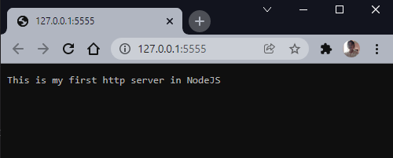
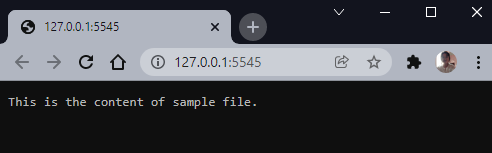
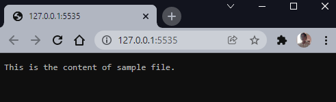

# HTTP Server and File Server

###  **HTTP Server**
https://github.com/Coderushnepal/RiyaMaharjan/tree/main/NodeJs/Assignment-1/httpServer

### **File Server**
https://github.com/Coderushnepal/RiyaMaharjan/tree/main/NodeJs/Assignment-1/fileServer

* Synchronous File Server:
https://github.com/Coderushnepal/RiyaMaharjan/blob/main/NodeJs/Assignment-1/fileServer/file_server.js

* Asynchronous File Server:
https://github.com/Coderushnepal/RiyaMaharjan/blob/main/NodeJs/Assignment-1/fileServer/file_server_async.js

| Synchronous File Server                                          | Asynchronous File Server                                           |
| ---------------------------------------------------------------- | ------------------------------------------------------------------ |
|  |  |